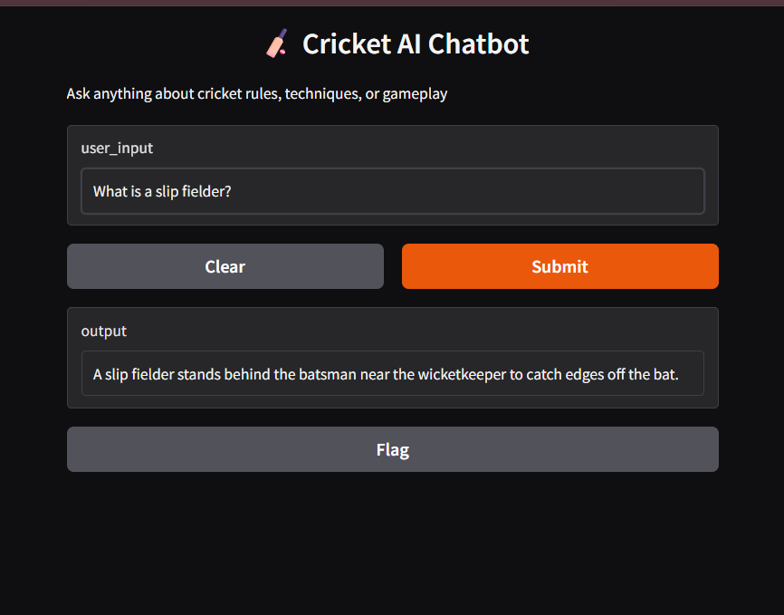
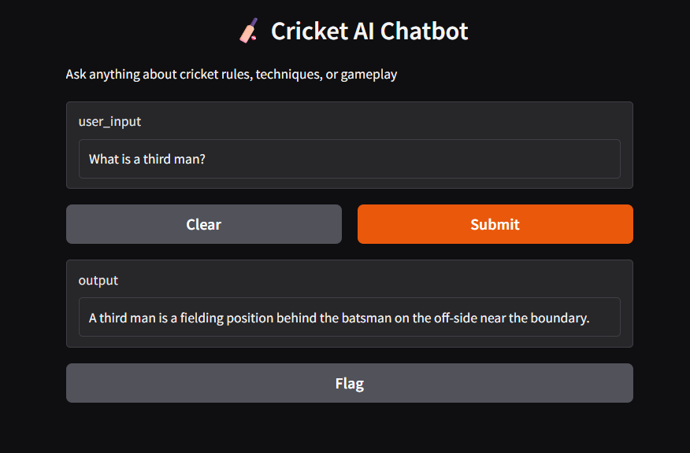

# 🏏 Cricket AI Chatbot

An AI-powered chatbot that answers cricket-related questions using Natural Language Processing (NLP).  
This system uses TF-IDF vectorization and cosine similarity to retrieve the most relevant answers from a structured dataset.

---

## 🚀 Project Overview

This project is a **retrieval-based AI chatbot** designed to answer questions about cricket rules, techniques, and gameplay.

Unlike generative AI systems, this chatbot:
- Does not rely on external APIs
- Works completely offline
- Provides fast and explainable responses

---

## 🎯 Problem Statement

Users often need quick answers to cricket-related questions. Searching manually can be time-consuming.

This project solves that by:
- Providing instant answers
- Using AI-based similarity matching
- Delivering accurate responses from structured data

---

## 🧠 How It Works

```

User Input
↓
Text Preprocessing
↓
TF-IDF Vectorization
↓
Cosine Similarity Matching
↓
Best Match Selection
↓
Response Output

```

---

## 🧩 System Architecture

- **Frontend:** Gradio UI
- **Backend:** Python
- **NLP Engine:** TF-IDF + Cosine Similarity
- **Data Source:** CSV file (Q&A pairs)

---

## 📂 Project Structure

```

cricket-chatbot/
│
├── data/
│   └── cricketfaqs.csv
│──assets/
└── screenshots/
|   ├── chat_example_1.png
|   ├── chat_example_2.png
|   ├── chat_example_3.png
├── src/
│   ├── app.py              # Entry point (UI)
│   ├── chat_bot.py        # Core chatbot logic
│   ├── train_bot.py       # Data loading & preprocessing
│   ├── utils/
│   │   ├── preprocessing.py
│   │   └── similarity.py
│
├── README.md
├── requirements.txt

````

---

## ⚙️ Installation & Setup

### 1. Clone the Repository

```bash
git clone https://github.com/your-username/cricket-chatbot.git
cd cricket-chatbot
````

---

### 2. Create Virtual Environment

```bash
python -m venv venv
```

Activate:

```bash
venv\Scripts\activate   # Windows
```

---

### 3. Install Dependencies

```bash
pip install -r requirements.txt
```

---

## 📦 Dependencies

* Python 3.10+
* pandas
* scikit-learn
* gradio

---

## ▶️ Run the Application

```bash
python -m src.app
```

Open in browser:

```
http://127.0.0.1:7860
```

---

## 🧪 Example Queries

* What is LBW?
* What is a slip fielder?
* How many players are there in cricket?
* What is an all-rounder?

---

## 📊 Results & Evaluation

### ✅ Achievements

* Successfully implemented an NLP-based chatbot
* Accurate responses for known queries
* Improved matching using TF-IDF similarity
* Robust handling of edge cases
* Fast and efficient performance

---

### 🧪 Test Results

| Test Case     | Input            | Output             | Status |
| ------------- | ---------------- | ------------------ | ------ |
| Valid Query   | What is LBW?     | Correct answer     | ✅      |
| Variation     | Explain LBW rule | Correct answer     | ✅      |
| Unknown Query | asdfghjkl        | Fallback response  | ✅      |
| Empty Input   | ""               | Validation message | ✅      |

---

### 📈 Performance

* Instant response time
* Lightweight (no API calls)
* Works offline
* Efficient for small datasets

---

## 🧠 Improvements Made

### Before:

* Exact keyword matching
* Poor handling of variations

### After:

* Implemented TF-IDF similarity
* Added preprocessing
* Introduced confidence threshold
* Improved accuracy significantly

---

## 🐞 Debugging Example

**Issue:** Incorrect responses for similar questions
**Cause:** No preprocessing
**Fix:** Applied text cleaning (lowercase, remove symbols)

---

## ⚠️ Edge Case Handling

* Empty input handled
* Invalid queries return fallback response
* Confidence threshold prevents wrong answers

---

## 🔍 AI Usage Transparency

* AI Technique: **TF-IDF + Cosine Similarity**
* No external APIs used
* Fully explainable system

---

## ⚠️ Limitations

* Limited to dataset knowledge
* Cannot generate new answers
* Domain-specific (cricket only)

---

## 🚀 Future Enhancements

* Integrate Generative AI (Gemini/OpenAI)
* Add voice-based interaction
* Expand dataset
* Deploy to cloud (AWS / Streamlit / HuggingFace)

---

## 🧠 Key Learnings

* NLP similarity techniques
* Text preprocessing
* Modular Python architecture
* Debugging and logging
* Handling real-world edge cases

---

## 🎯 Conclusion

This project demonstrates how to build a **lightweight AI chatbot system** using NLP techniques, focusing on performance, simplicity, and explainability.

## 📸 Application Screenshots

### 🏏 Chatbot Interface


---

### 💬 Example Interaction 1

**Input:** What is an all-rounder?



---

### 💬 Example Interaction 2

**Input:** What is a slip fielder?




